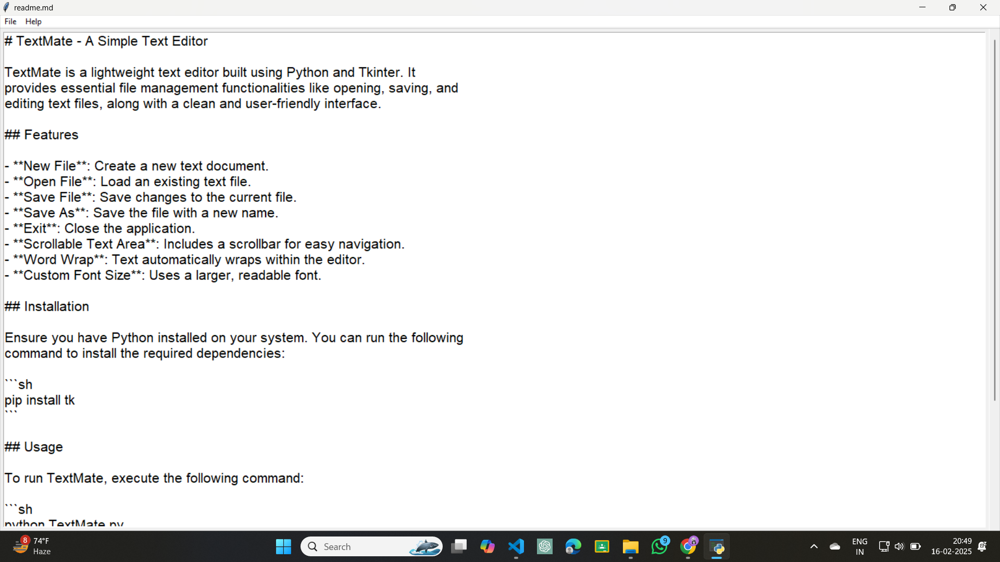
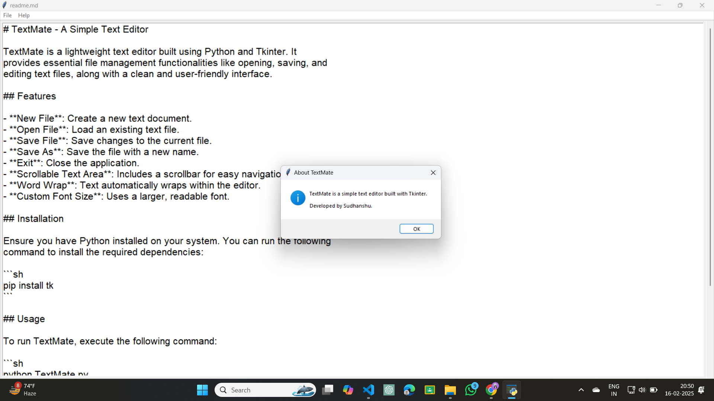

# TextMate - A Simple Text Editor

TextMate is a lightweight text editor built using Python and Tkinter. It
provides essential file management functionalities like opening, saving, and
editing text files, along with a clean and user-friendly interface.

## Features

- **New File**: Create a new text document.
- **Open File**: Load an existing text file.
- **Save File**: Save changes to the current file.
- **Save As**: Save the file with a new name.
- **Exit**: Close the application.
- **Scrollable Text Area**: Includes a scrollbar for easy navigation.
- **Word Wrap**: Text automatically wraps within the editor.
- **Undo and Redo**: You can do Undo and Redo.
- **Find all occurrence and replace all feature**: Edit menu where you can find
  and replace patterns.

## Installation

Ensure you have Python installed on your system. You can run the following
command to install the required dependencies:

```sh
pip install tk
```

## Usage

To run TextMate, execute the following command:

```sh
python TextMate.py
```

## Screenshots

 

## Author

Developed by Sudhanshu 🚀
